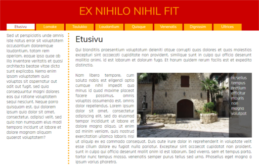
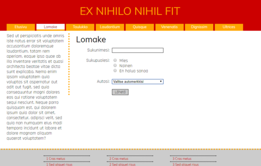
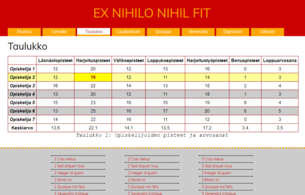

# Website Exercise: Ex Nihilo Nihil Fit

A website exercise project for school. The languages used are HTML, CSS and JavaScript.
The text in the site is mostly in pseudo-Latin placeholder text but some key words are in Finnish.
The site uses a header and a footer. Only the first three links in the header are usable.
The pages excluding the table page scale with the browser, and when the browser is narrow enough, a burger menu is displayed.
All of the site's features, styles and colors were listed in a requirement document.

## Pages

### Front Page / Etusivu
Has text arranged into two columns and an image.

### Form / Lomake
Has text on the left, a text input for the user's last name, radio buttons for the user's gender and a dropdown list for a car brand (including an option for 'other' which opens a text input).

### Table / Taulukko
Has a table of students' credits and grades with a caption under it. Cells and rows can be highlighted by hovering the mouse cursor over them.

